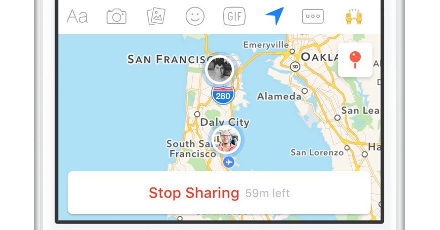

# Overview
Project Hawkeye is a React Native Application that aims to help users find a GPS location by pointing them towards the correct direction.

The Share Location functionality in apps such as _Find My Friends_, _FB Messenger_, _iMessage_, and many other apps, already allow users to find each other from a top-down map view. 

However, they only help users in a 2D space. This works well if users are *meeting up* on ground level. Apps such as these work less well if:
1. The users are on very uneven terrain
1. The users are having difficulty picking out each other, whether from noisy surrounding terrain, obstructions in between them, or crowds of people
1. The users are trying to locate each other from afar, without needing to meet up just yet

For example, if two people are trying to locate each other from opposite sides of a packed sporting stadium, but they don't want to wander around or leave their seats. In such a situation, picking out each other from the sea of people with only a top-down 2D map view would be more challenging. With this app, users can see through their camera's viewfinder, as the app guides them towards their friend's location.

#Inspiration
## Problem
Project Hawkeye was inspired by my friend, Alberto Quinones, who described a problem he was having at work. 

He works at a construction company that does work on highways, and he needs to fly drones in order to photograph and scan the work site in order to produce computer models. 
As the highway segment could be quite long, the flight path could stray far away from the pilot's position, where it may become quite easy to lose track of exactly where the drone is in the sky. 

He complained that, if only there was a way to put a GPS tracker on the drone, and have a way to pinpoint to the pilot where the drone is, it would make the job of keeping an eye on the drone more easy. 

Me, having used the [SkyView](https://apps.apple.com/us/app/skyview/id404990064) App (an app that uses Augmented Reality to help users find celestial bodies and satelites) before, thought that combining the SkyView camera with location sharing would be just what he needed.

## Naming
In the game _The Legend of Zelda: Twilight Princess_, there is a mask that Link can wear, called a [Hawkeye](https://zelda.fandom.com/wiki/Hawkeye). It is effectively a telescope, allowing the wearer to see distant objects. When paired with the bow, players can snipe accurately to long distances.  

The name is fitting, since the app aims to help users target and find distant points, and the original inspiration of the app was to find a small airborne object (drone) out of the sky.