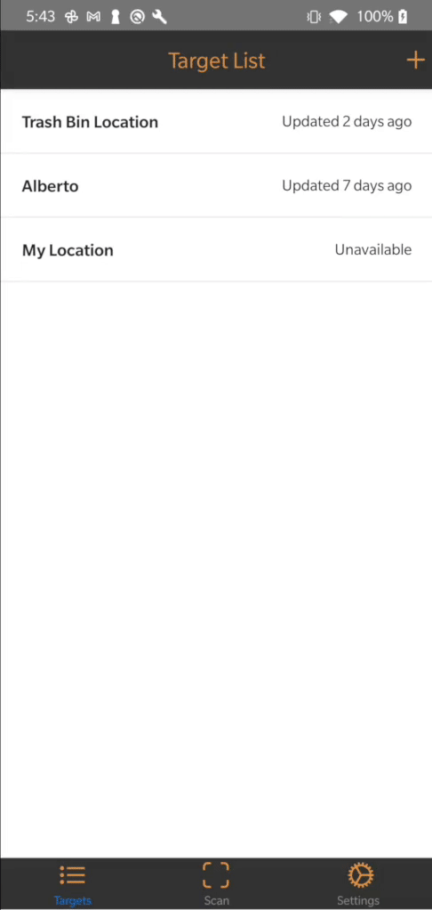
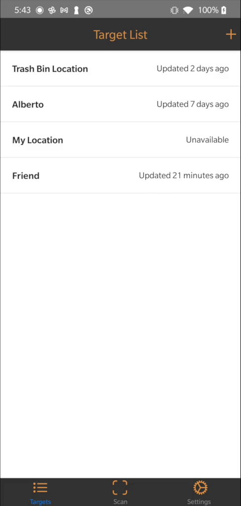
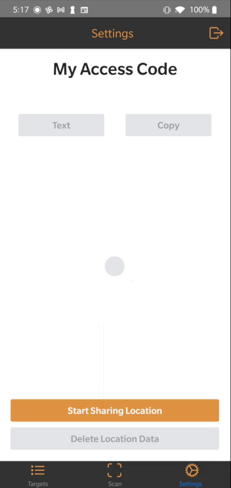
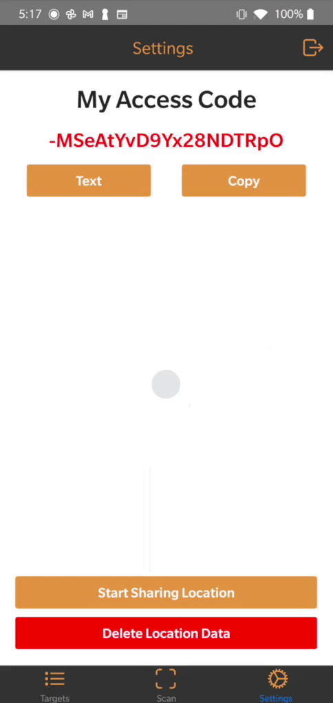
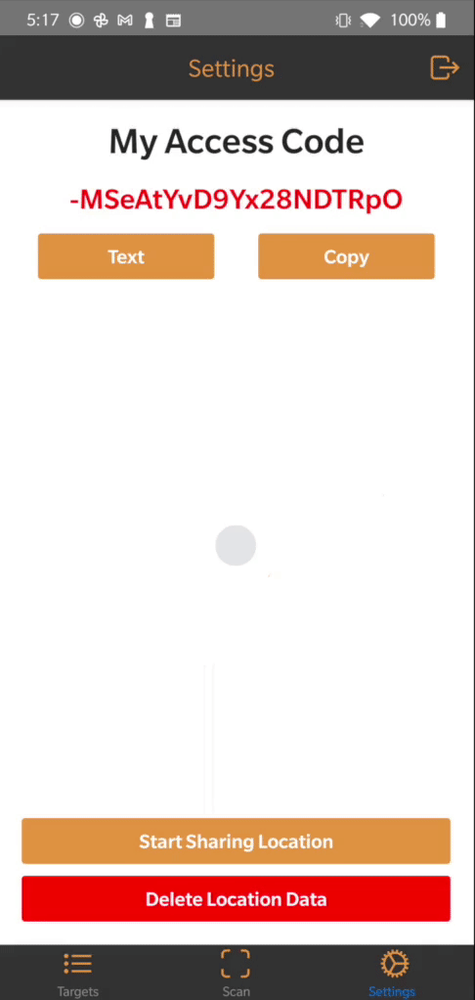

# Overview
Project Hawkeye is a React Native Application that aims to help users find a GPS location by pointing them towards the correct direction.

The Share Location functionality in apps such as _Find My Friends_, _FB Messenger_, _iMessage_, and many other apps, already allow users to find each other from a top-down map view.

However, they only help users in a 2D space. This works well if users are *meeting up* on ground level. Apps such as these work less well if:
1. The users are on very uneven terrain or different elevation levels
1. The users are having difficulty picking out each other, whether from noisy surrounding terrain, obstructions in between them, or crowds of people
1. The users are trying to locate each other from afar, without needing to meet up just yet

For example, if two people are trying to locate each other from opposite sides of a packed sporting stadium, but they don't want to wander around or leave their seats. In such a situation, picking out each other from the sea of people with only a top-down 2D map view would be more challenging. With this app, users can see through their camera's viewfinder, as the app guides them towards their friend's location.

# Inspiration
## Problem
Project Hawkeye was inspired by my friend, Alberto Quinones, who described a problem he was having at work.

He works at a construction company that does work on highways, and he needs to fly drones in order to photograph and scan the work site in order to produce computer models.
As the highway segment could be quite long, the flight path could stray far away from the pilot's position, where it may become quite easy to lose track of exactly where the drone is in the sky.

He complained that, if only there was a way to put a GPS tracker on the drone, and have a way to pinpoint to the pilot where the drone is, it would make the job of keeping an eye on the drone more easy.

Me, having used the [SkyView](https://apps.apple.com/us/app/skyview/id404990064) App (an app that uses Augmented Reality to help users find celestial bodies and satelites) before, thought that combining the SkyView camera with location sharing would be just what he needed.

## Naming
In the game _[The Legend of Zelda: Twilight Princess](https://zelda.gamepedia.com/The_Legend_of_Zelda:_Twilight_Princess)_, there is a mask that Link can wear, called a [Hawkeye](https://zelda.fandom.com/wiki/Hawkeye). It is effectively a telescope, allowing the wearer to see distant objects. When paired with the bow, players can snipe accurately to long distances.  

The name is fitting, since the app aims to help users target and find distant points, and the original inspiration of the app was to find a small airborne object (drone) out of the sky.

# How it works
By having access to the user's and target's GPS coordinates and elevation, the direction that the user need to turn in order to face the target directly can be computed. Similarily, the direct distance between those two points can also be calculated. Using the elevation difference between the two points and the distance between the targets, the angle above or below the horizon from the user can also be calculated.These values are currently being done in helper functions inside /src/helpers.

Once it is known which heading the user needs to face, and what angle above or below the horizon the target is, all that's left to do is to use the phone's sensors to direct the user to point the camera at the correct heading and pitch, and the target should be in the camera's crosshairs.

# Walkthrough
## Target List and Management Screens.
In order to find your friend or family, they need to send you their access code and share their location. (More information on how to do that will be located on the Settings Screen.)

Once you receive the code, you will add it to your list by clicking on the + in the upper corner, and fill out the details.

Next, select the target you want to search for.   

You can also deselect the active target, switch to a different target, or edit the target's name and access code by tapping or sliding on it from the List.

## Scan Screen
Once you have selected n active target, you can head over to the scan screen, where you would be able to search for the target by scanning your environment.

An approximate direction of the target is represented by an orange ◇, with the distance shown below. A circle in the middle indicates where your phone is pointing, and an arrow points you toward the target. The circular reticle changes color from red to yellow to green as you get closer to the target.

## Settings Screens
On this screen, you manage your location data.
In order to share your location with a friend, you will need to start sharing your location and send them your access code.

Your last known shared location will remain accessible by your Access Code even after you stop providing up-to-date location information and stop sharing your location. By deleting your location data from the cloud, your friends will need to get a new access code from you in order to access your location again. Your old code will be retired and those who you shared that code with will no longer be able to access your location data.

